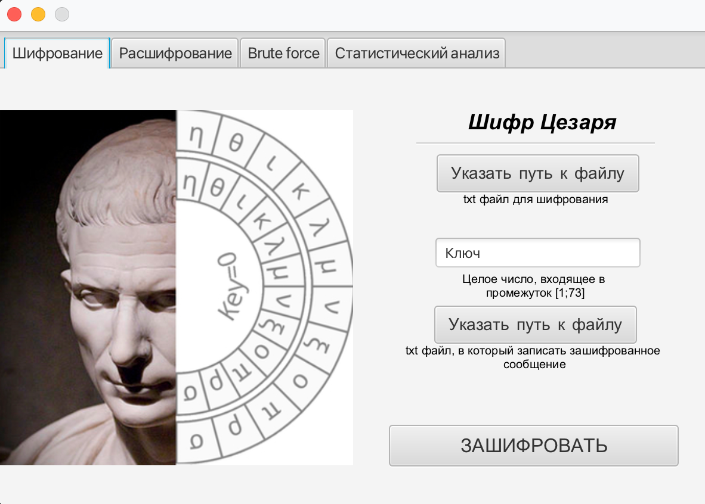

# Криптоанализатор (Шифр цезаря)

### Данная программа позволяет шифровать/дешифровать текст из txt файла на компьютере и записать результат в другой текстовый файл

### Клиентская часть: javaFX

-------------------

### Запуск приложения
- из файла com.javarush.mashnin.cryptoanalyzer.App

-------------------

Структура директорий
-------------------

```
src/main
    java/              
        constant/      содержит константы
        controller/    содержит контроллеры BruteForce, Decryption, Encryption, StatisticAnalysis
        exception/     содрежит исключения
        service/       содержит классы, реализующие логику приложения
        App            точка входа
    resources/         
        view/          содержит fxml файлы
        images/        картинки
        sample.txt     текст для статистики
```
### Запущенное приложение
